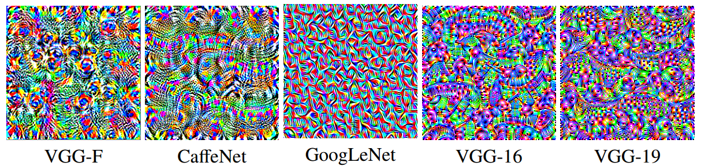

# Fast Feature Fool

Code for the paper
**[Fast Feature Fool: A data independent approach to universal adversarial perturbations]()**

Konda Reddy Mopuri, Utsav Garg, R. Venkatesh Babu

This repository can be used to generate universal adversarial perturbations for 5 popular CNNs(VGG-F, CaffeNet, VGG-16, VGG-19, GoogLeNet) without using any data from the target distrubution.



## Usage

* To generate a new perturbation give the following command
```
python train.py --network vggf
```
* To evaluate the classification and fooling performace of the generated perturbation
```
python evaluate.py --network vggf --adv_im perturbations/perturbation_vggf_mean.npy --img_list <path to ilsvrc val list> --gt_labels <path to validation labels list>
```

* The network argument can take the following five arguments `vggf, caffenet, vgg16, vgg19 and googlenet`

## Precomputed perturbations
The `perturbations` has precomputed perturbations for five cnns, 

Named `perturbation_<cnn name>_mean.npy`, use mean of activations as the loss function, these were used to report results in the paper.

| Network        | Top-1 Accuracy           | Fooling Rate  |
| ------------- |:-------------:| :-----:|
| VGG-F      | 53.43% | 81.59% |
| CaffeNet      | 56.02% | 80.92% |
| VGG-16      | 65.77%      |   47.10% |
| VGG-19      | 66.14%      |   43.62% |
| GoogLeNet | 67.92%      |    56.44% |


### Reference:
```

```

Contact [Utsav Garg](http://utsavgarg.github.io/) if you have questions.
